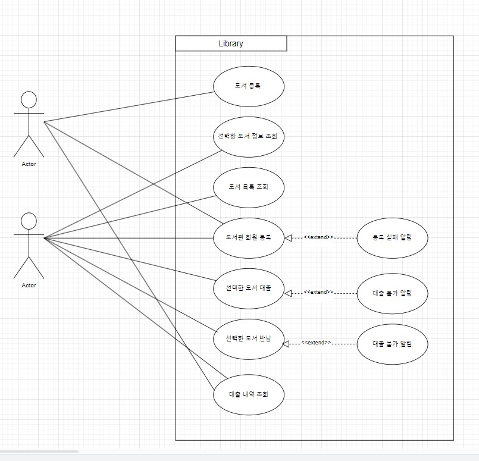
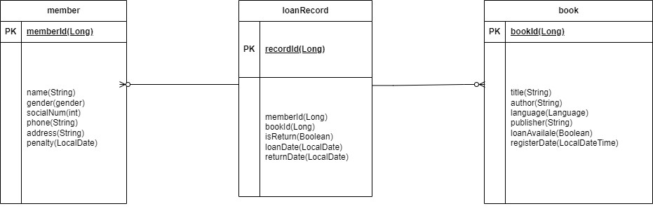
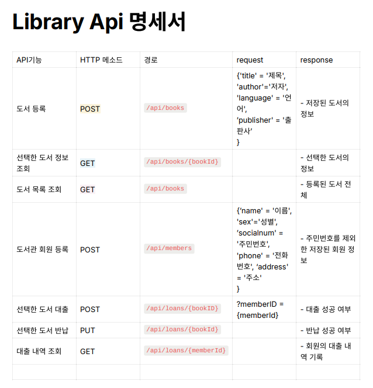

# 📋 도서관 서버

## 💻 프로젝트 개요
SpringBoot를 기반으로한 기본적인 CRUD 기능을 구현하여, 도서 등록, 도서 정보 조회, 대출, 반납 , 대출 조회 등을 가능하게 하는 것을 목표로 한다. 이번 프로젝트에서는 JPA를 사용하여 JDBC보다 편리하고 간결하게 데이터에 접근한다.

## 🎯 구현 목록
- [x]  도서 등록 기능
    - `제목`, `저자`, `언어`, `출판사`,`등록일`을 저장할 수 있습니다.
    - 저장된 도서의 정보를 반환 받아 확인할 수 있습니다.
- [x]  선택한 도서 정보 조회 기능
    - 선택한 도서의 정보를 조회할 수 있습니다.
- [x]  도서 목록 조회 기능
    - 등록된 도서 전체를 조회할 수 있습니다.
    - 조회된 도서 목록은 `등록일` 기준 오름차순으로 정렬 되어있습니다.
- [x]  도서관 회원 등록 기능
    - `이름`, `성별`, `주민번호`,`전화번호`, `주소`를 저장할 수 있습니다.
        - `주민번호` 와 `전화번호` 는 중복될 수 없습니다.
    - 저장된 회원의 정보를 반환 받아 확인할 수 있습니다.
        - 반환 받은 회원의 정보에 `주민번호`는 제외 되어있습니다.
- [x]  선택한 도서 대출 기능
    - 회원은 선택한 도서를 대출받을 수 있습니다.
        - `도서의 식별값`과 `회원의 식별값`이 함께 요청됩니다.
        - 반납하지 않은 책이 있다면 대출이 불가능합니다.
        - 선택한 도서가 현재 대출 상태라면 대출이 불가능합니다.
    - 회원의 대출 내역을 기록할 수 있습니다.
        - 대출 내역 기록에는 `도서의 식별값`, `회원의 식별값`, `반납상태`, `대출일`, `반납일`을 저장할 수 있습니다.
        - JPA의 연관관계 매핑 애너테이션을 사용하지 않고 구현합니다.
    - 대출 성공을 확인할 수 있는 값을 반환합니다.
        - ex) HTTP Status Code, Error Message …
- [x]  선택한 도서 반납 기능
    - 선택한 도서를 반납할 수 있습니다.
        - 대출 내역 기록의 `반납상태`와 `반납일`이 변경됩니다.
- [x]  대출 내역 조회 기능
    - 회원의 대출 내역 기록을 조회할 수 있습니다.
        - 대출 내역 기록에는 회원의 `이름`과 `전화번호`, 도서의 `제목`과 `저자`가 포함 되어있어야 합니다.
    - 조회된 대출 내역 기록은 `대출일` 기준 오름차순으로 정렬 되어있습니다.

## 🔥 **추가 구현 기능**

- [x]  JPA의 연관관계 매핑 애너테이션을 사용하지 않고 구현된 부분들을 사용해서 처리되도록 변경합니다.
    - 매핑 애너테이션으로 변경 되더라도 이전과 기능은 동일하게 동작되어야 합니다.
- [x]  대출 내역 조회 조건 추가
    - 대출 내역을 조회 할 때 반납이 완료된 대출 내역은 제외하고 조회할 수 있습니다.
- [x]  패널티 기능
    - 회원이 도서를 반납할 때 `대출일` 기준으로 7일 이내에 반납하지 않았다면 회원에게 `패널티`를 부여합니다.
    - `패널티`를 받은 회원은 2주일 동안 도서를 대출할 수 없습니다.
- [x]  도서 대출 가능 여부 기능
    - 선택한 도서 혹은 도서 목록을 조회 했을 때 도서의 대출 가능 여부를 확인할 수 있습니다.
- [x]  선택한 도서가 이미 대출 상태일 때 등의 예외가 발생하는 경우 API 요청 실패(예외상황)에 대해 판단할 수 있는 Status Code, Error 메시지등의 정보를 반환합니다.

## 🛠️ 기술 스택
- Spring Boot
- JPA/Hibernate
- MySQL

## 🔍 Use Case Diagram

## 📁 ERD

## 📃 API 명세서

https://documenter.getpostman.com/view/28626611/2sA2xb7brc

## 개발자

- 신수현 a01065849764@gmail.com

